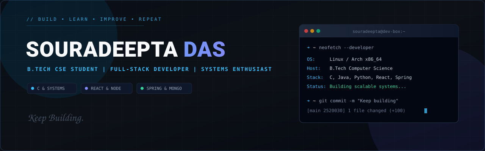

  

# Souradeepta Das
### B.Tech CSE Student • Full-Stack Developer • Systems Enthusiast

**Building software. Learning systems. Solving problems.**

[GitHub](https://github.com/soup-roop) • [LinkedIn](https://linkedin.com)

---

### 👨‍💻 About Me

I'm a Computer Science Engineering student passionate about full-stack web engineering, systems programming, and building robust backends.

- 🔭 **Working on:** Full-stack web platforms and embedded IoT systems
- 🌱 **Learning:** Operating systems internals, distributed architectures, and algorithms
- 💬 **Ask me about:** C, Java, Python, React, MongoDB, and REST APIs
- ⚡ **Fun fact:** Passionate about low-level performance and clean architectural design

---

### 🛠️ Tech Stack

#### Languages

  

#### Frontend & UI

  

#### Backend & Databases

  

#### Tools & DevOps

  

---

### 📊 GitHub Activity

<picture>
  <source media="(prefers-color-scheme: dark)" srcset="https://raw.githubusercontent.com/soup-roop/soup-roop/output/github-contribution-grid-snake-dark.svg">
  <source media="(prefers-color-scheme: light)" srcset="https://raw.githubusercontent.com/soup-roop/soup-roop/output/github-contribution-grid-snake.svg">
  
</picture>

  <em>Consistent commits. Continuous learning. Building in public.</em>

---

### 📚 Currently Exploring

  

  <code>DSA</code> • <code>Operating Systems</code> • <code>Full-Stack Development</code> • <code>Cloud & DBs</code>

  Build • Learn • Improve • Repeat

